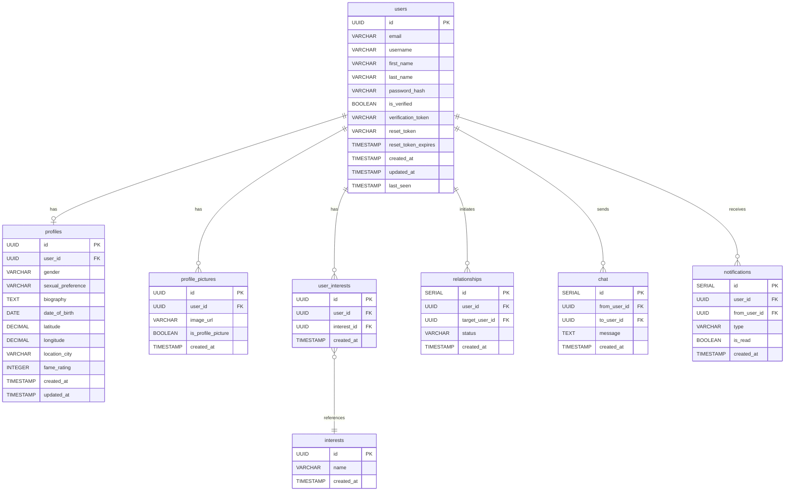
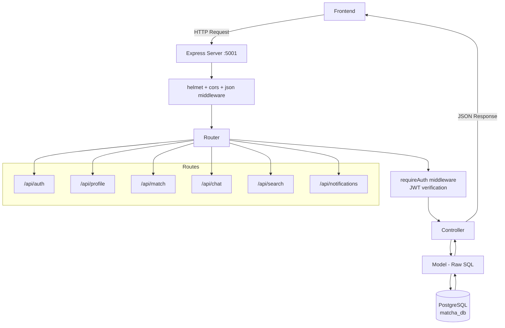

# Matcha — Backend

A dating app backend built with TypeScript, Node.js, Express, and PostgreSQL.

> For full project status and build tracker, see [engineering-roadmap.md](./engineering-roadmap.md)

---

## Team

- **Jack** — Backend (auth, profile, search/matching)
- **Daryl** — Backend (search, match, chat) & Frontend

---

## Stack

- **Runtime:** Node.js + TypeScript
- **Framework:** Express
- **Database:** PostgreSQL 16 (raw SQL, no ORM)
- **Auth:** JWT
- **Email:** Mailgun (SMTP)
- **File uploads:** Multer
- **Real-time:** Socket.IO
- **Containerisation:** Docker

---

## Quick Start

**1. Start Docker:**
```bash
docker compose up --build
```

**2. Verify server is running:**
```bash
curl http://localhost:5001/health
```

**3. Access points:**
- Backend API: `http://localhost:5001`
- Frontend: `http://localhost:5173`
- Database: `localhost:5432`

---

## Environment Variables

All credentials live in `backend/.env` (gitignored). Required keys:

```
NODE_ENV
PORT
DB_HOST, DB_PORT, DB_NAME, DB_USER, DB_PASSWORD
JWT_SECRET, JWT_EXPIRES_IN
EMAIL_HOST, EMAIL_PORT, EMAIL_USER, EMAIL_PASSWORD
MAILGUN_API_KEY, MAILGUN_DOMAIN
FRONTEND_URL
MAX_FILE_SIZE, ALLOWED_FILE_TYPES
```

---

## Project Structure

```
backend/
├── src/
│   ├── config/
│   │   ├── database.ts          # PostgreSQL connection pool
│   │   └── initDB.ts            # Table creation on server start
│   ├── controllers/
│   │   ├── auth.controller.ts
│   │   ├── chat.controller.ts        (Daryl's)
│   │   ├── match.controller.ts       (Daryl's)
│   │   ├── notification.controller.ts
│   │   ├── profile.controller.ts
│   │   └── search.controller.ts      (Jack & Daryl's)
│   ├── database/
│   │   ├── migrations/
│   │   │   └── 001_initial_schema.sql
│   │   └── seed.ts              # Admin account + 500+ fake profiles
│   ├── middleware/
│   │   ├── auth.middleware.ts   # requireAuth — JWT verification
│   │   └── multer.ts            # Profile picture upload handling
│   ├── models/
│   │   ├── chat.model.ts             (Daryl's)
│   │   ├── match.model.ts            (Daryl's)
│   │   ├── notification.model.ts
│   │   ├── profile.model.ts
│   │   ├── search.model.ts           (Daryl's)
│   │   └── user.model.ts
│   ├── routes/
│   │   ├── auth.routes.ts
│   │   ├── chat.routes.ts            (Daryl's)
│   │   ├── match.routes.ts           (Daryl's)
│   │   ├── notification.routes.ts
│   │   ├── profile.routes.ts
│   │   └── search.routes.ts          (Daryl's)
│   ├── types/
│   │   ├── chat.types.ts             (Daryl's)
│   │   ├── match.types.ts            (Daryl's)
│   │   ├── search.types.ts
│   │   └── user.types.ts
│   ├── utils/
│   │   ├── email.ts              # Mailgun verification/reset emails
│   │   ├── geo.ts                # Haversine distance calculation
│   │   └── validation.ts
│   └── server.ts                 # Express app entrypoint
├── uploads/                       # Profile pictures (gitignored, persists in container)
├── .env                           # Gitignored
├── Dockerfile
├── package.json
├── tsconfig.json
├── engineering-roadmap.md
└── profiles.json
```

---

## Database Schema



---

## Architecture



Notifications are also pushed to the frontend in real time over Socket.IO: `match.controller.ts` emits a `notification` event (`like`, `match`, `view`, `unlike`) and `chat.controller.ts` emits a `new_messages` event, both via `io.to(targetUserId).emit(...)` to the recipient's personal room (joined as `socket.join(userId)` on connect).

---

## API Reference

### Auth Routes — `/api/auth`

| Method | Path | Auth | Description |
|--------|------|------|-------------|
| POST | `/api/auth/register` | None | Register new account, sends verification email (rolls back user on email failure) |
| GET | `/api/auth/verify` | None | Verify email via token, sets `is_verified = true` |
| POST | `/api/auth/login` | None | Login with username + password; blocks unverified users and resends verification email |
| POST | `/api/auth/forgot-password` | None | Request password reset (unified response to prevent account enumeration) |
| POST | `/api/auth/reset-password` | None | Reset password using reset token |
| POST | `/api/auth/logout` | None | Clears the `access_token` cookie |

### Profile Routes — `/api/profile`

| Method | Path | Auth | Description |
|--------|------|------|-------------|
| GET | `/api/profile/me` | ✅ | Lightweight profile (username, name, picture, isProfileCompleted) |
| GET | `/api/profile/details` | ✅ | Full profile page data (interests, pictures) |
| POST | `/api/profile/details` | ✅ | Update full profile (users + profiles + interests) |
| POST | `/api/profile/profilepic` | ✅ | Upload/replace the single profile picture (multer, max 5MB, jpeg/jpg/png/webp) |
| GET | `/api/profile/profilepic` | ✅ | Get the current profile picture |
| DELETE | `/api/profile/profilepic` | ✅ | Delete the current profile picture |
| POST | `/api/profile/pictures` | ✅ | Upload gallery pictures (up to 4 non-profile pictures) |
| GET | `/api/profile/pictures` | ✅ | Get gallery pictures for current user |
| DELETE | `/api/profile/pictures/:pictureId` | ✅ | Delete one gallery picture |

### Match Routes — `/api/match`

| Method | Path | Auth | Description |
|--------|------|------|-------------|
| POST | `/api/match/update` | ✅ | Update relationship status (like/unlike/block etc.) between users |
| GET | `/api/match/status` | ✅ | Get relationship status with a given user |
| GET | `/api/match/connected` | ✅ | Get all mutually-connected (matched) users |
| GET | `/api/match/account` | ✅ | Get account-level data for the current user |

### Chat Routes — `/api/chat`

| Method | Path | Auth | Description |
|--------|------|------|-------------|
| POST | `/api/chat/send` | ✅ | Send a chat message to another user; emits `new_messages` over Socket.IO to the recipient |
| GET | `/api/chat/` | ✅ | Get chat history with a given user (`?targetId=`) |

### Notification Routes — `/api/notifications`

| Method | Path | Auth | Description |
|--------|------|------|-------------|
| GET | `/api/notifications` | ✅ | Get all notifications for the current user, newest first |
| PATCH | `/api/notifications/read` | ✅ | Mark all of the current user's unread notifications as read |

### Search Routes — `/api/search`

| Method | Path | Auth | Description |
|--------|------|------|-------------|
| GET | `/api/search/` | ✅ | Get recommended profiles (sortable/filterable, see below) |
| GET | `/api/search/:id` | ✅ | Get another user's full profile, including computed `online` status (true if `last_seen` within last 5 minutes) |

**Query parameters for `GET /api/search`:**

| Param | Type | Description |
|-------|------|-------------|
| `tags` | string (comma-separated) | Filter by interest tags, e.g. `?tags=vegan,geek` |
| `sortBy` | string | `age`, `fame_rating`, `common_tags`, or `distance` (default) |
| `maxDistance` | number | Max distance in km; excludes profiles with unknown distance when set |
| `minAge` / `maxAge` | number | Filter by age range |
| `minFame` / `maxFame` | number | Filter by fame rating range |
| `minCommonTags` | number | Minimum number of shared interest tags |

---

## Database

Connect to the running database:
```bash
docker exec -it matcha-database-1 psql -U matcha_user -d matcha_db
```

Useful commands:
```sql
\dt                  -- list all tables
\d users             -- inspect users table
SELECT * FROM users; -- view all users
```

---

## Seed Account

A default admin account is seeded on startup:
- **Email:** admin@matcha.com
- **Username:** admin
- **Password:** MatchaAdmin2026!

---
*API reference auto-generated from route files. Run the update-readme skill after adding new endpoints.*
